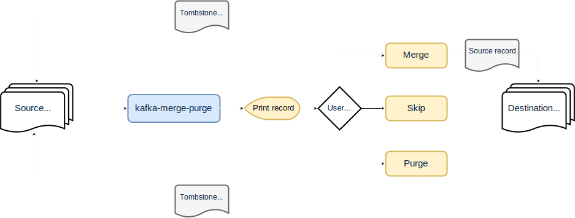

# kafka-merge-purge
[](https://github.com/flyeralarm/kafka-merge-purge/actions)
[](https://hub.docker.com/repository/docker/flyeralarm/kafka-merge-purge)
[](LICENSE)

Pipe data between Kafka topics with ease and choose what to do for individual records.

## Overview
This command line utility allows you to easily merge one Kafka topic into another, marking records from the source topic
for the deletion in the process. Designed for use with dead letter queues, you may choose the action to take for every
message in the source topic.



The application uses sane defaults for both producers and consumers, which partially may be overwritten by the user.
Currently, these defaults include the idempotent mode and `all` acknowledgements for the producer as well as
the `read_committed` isolation level for the consumer. Furthermore, the consumer property `auto.offset.reset` is set to
`earliest` by default, since records from the source topic usually are marked for deletion so their offsets might no longer
be available for the next execution of the application.

Note that records will be deserialized for display purposes, but will always be written as their raw, untouched bytes.

## Usage
```sh
Usage: kafka-merge-purge [-aAhvV] [-n[=<noCommit>]] [-t[=<transactionalId>]] [-b=<bootstrapServers>]
                         [-C=<consumerPropertiesFilePath>] -g=<consumerGroup> [-O=<propertiesFilePath>]
                         [-P=<producerPropertiesFilePath>] [-c=<String=String>]... [-o=<String=String>]...
                         [-p=<String=String>]... (ask | merge-all | purge-all | print)
Merges Kafka records from one topic into another, marking them as deleted in the old topic in the process
  -h, --help       Show this help message and exit.
  -V, --version    Print version information and exit.
  -b, --bootstrap-servers=<bootstrapServers>
                   Kafka Bootstrap servers as comma-delimited list.
                   Takes precedence over properties files.
  -g, --group=<consumerGroup>
                   Consumer group for ingesting the source topic
  -O, --properties=<propertiesFilePath>
                   A Java Properties file for shared client configuration (optional)
  -o, --property=<String=String>
                   Specify a shared client configuration property directly.
                   May be used multiple times.
                   These options takes precedence over properties files.
  -C, --consumer-properties=<consumerPropertiesFilePath>
                   A Java Properties file for consumer client configuration (optional)
  -c, --consumer-property=<String=String>
                   Specify a consumer client configuration property directly.
                   May be used multiple times.
                   These options takes precedence over properties files.
  -P, --producer-properties=<producerPropertiesFilePath>
                   A Java Properties file for consumer client configuration (optional)
  -p, --producer-property=<String=String>
                   Specify a producer client configuration property directly.
                   May be used multiple times.
                   These options takes precedence over properties files.
  -t, --transaction[=<transactionalId>]
                   Produce records within a transaction.
                   Optional value is the transactional ID to use.
                   Defaults to a random UUID
  -n, --no-commit[=<noCommit>]
                   Do not commit consumer offsets.
                   Explicitly set to false to make print commit its offsets
  -A, --avro-key   Force Avro deserializer for record keys.
                   Requires schema.registry.url consumer property to be set
  -a, --avro       Force Avro deserializer for record values.
                   Requires schema.registry.url consumer property to be set
  -v, --verbose    Enable verbose logging
Commands:
  ask        Asks for every record from the source topic whether it should be merged into the destination topic or
               simply purged
  merge-all  Merges all records from the source topic into the specified destination topic and marks them for deletion
               in the source topic
  purge-all  Purges (i.e. writes a tombstone record for) every record from the specified topic
  print      Prints all records from the specified topic. Does not commit offsets by default
```

Supported shared, consumer and producer properties are those listed in the official documentation for [consumers](https://docs.confluent.io/platform/current/installation/configuration/consumer-configs.html)
and [producers](https://docs.confluent.io/platform/current/installation/configuration/producer-configs.html) respectively.

## Running in Docker
`kafka-merge-purge` is available through Docker Hub, so running it in a container is as easy as:

```sh
docker run --rm -it -v "$(pwd)/":/data flyeralarm/kafka-merge-purge -b kafka.example.com:9092 -g consumer-group ask sourceTopic destinationTopic
```

A more complete example with an external properties file and Avro for value deserialization might look as follows.
```sh
docker run --rm -it -v "$(pwd)/":/data flyeralarm/kafka-merge-purge --properties /data/client.properties -g consumer-group -a ask sourceTopic destinationTopic
```
This requires a `client.properties` file in your current working directory, with the following content:
```properties
bootstrap.servers=kafka.example.com:9092
schema.registry.url=http://schema-registry.example.com
```

Please keep in mind that using a tagged release may be a good idea.

## Options
### Transactions
kafka-merge-purge supports transactions out of the box. Simply specify the `-t` option to enable the transactional producer.
You may optionally specify the transactional ID to be used as a parameter to the `-t` option or through a configuration property.
If no transactional ID is specified, a random UUID will be used.

### Record deserialization
By default, record keys and values will be deserialized as strings. You can influence this through the regular `key.deserializer` and `value.deserializer` consumer properties.

Currently, kafka-merge-purge only comes with native support for the [Apache Avro](https://avro.apache.org/) serialization format in addition the standard deserializers provided by Kafka.
You may specify the `-A` and `-a` options to enable Avro deserialization for record keys and values respectively.
Note that you will have to provide the `schema.registry.url` consumer property as well in order for records to be serialized according to their schema.

## Development

Docker is used to build and test `kafka-merge-purge` for development.

```sh
# test & build
docker build -t flyeralarm/kafka-merge-purge .

# run it in Docker
docker run --rm -it -v "$(pwd)/":/data flyeralarm/kafka-merge-purge -b kafka:9092 -g consumer-group ask sourceTopic destinationTopic
```

If you want to execute the application outside of Docker, you may use the `run` Gradle task. For example:
```sh
./gradlew run --args="--properties client.properties -g consumer-group ask sourceTopic destinationTopic"
```
